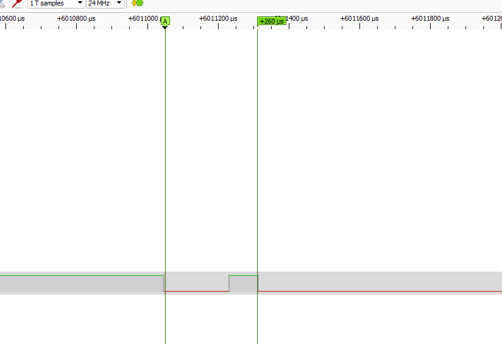
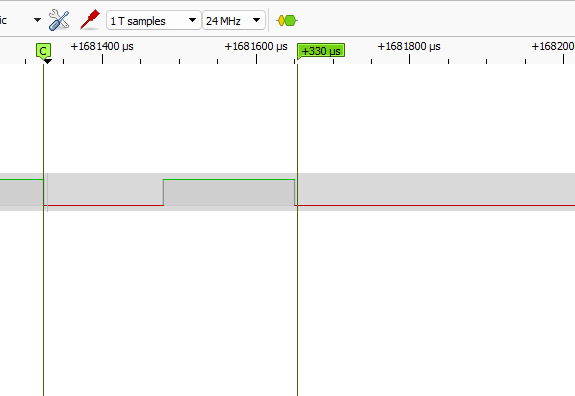
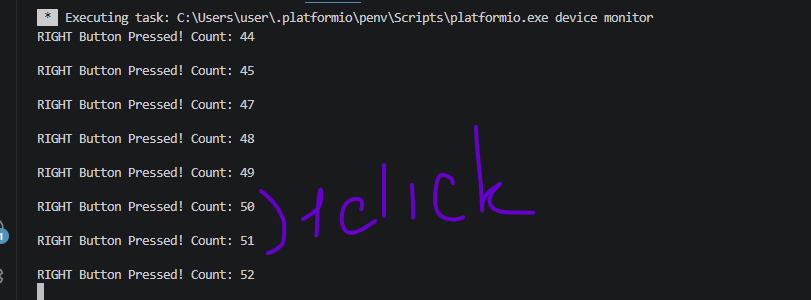

- Homework-1-5
  
1. using build-in INPUTPULLUP with prev homework codes
2. Process:
   1. 
   2. 
   3. 
   4. [Code](../workshop-1-5/src/main.cpp)
   5. Sometimes we have two extra calls
3. Results:
      1. On MCU i have 1-2 extra call, on logical analyzer  0-1 extra spike
      2. MCU has extra calls comparing to analyzer as it can see pulses using interrupts that are invisible to analyzer because of SamplingRate.  But also interrupts have blind zone + execution time that also can "sample" input signal and skip some spikes. But with 1-2 spike in my experiment hard to see this situation 
      3. 0.3ms
      4. >1ms
   