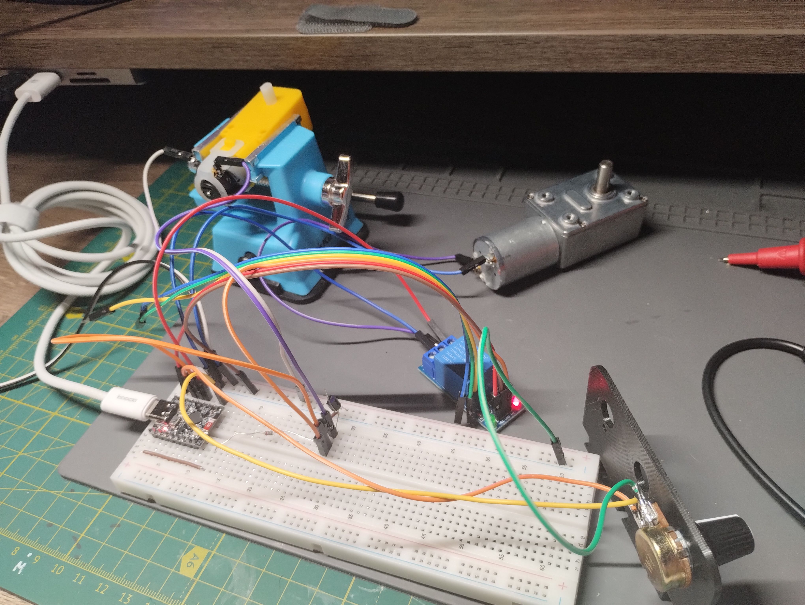
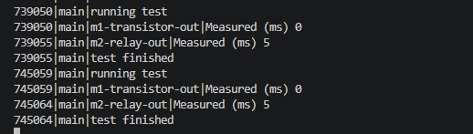

# Workshop 2-2

- **Task 1: Compare how fast Relay vs Transistor**
  - [`DelayMeasure`](src/DelayMeasure.h#L5) class measures the time from motor start until an input pin reaches the expected level
    - [`onStart()`](src/DelayMeasure.h#L35) records the start timestamp; [`tick()`](src/DelayMeasure.h#L40) polls the pin and prints elapsed ms
    - `measure1` watches the transistor output ([`IN_PIN_1`](src/main.cpp#L10)); `measure2` watches the relay output ([`IN_PIN_2`](src/main.cpp#L11))
  - [`MotorController`](src/MotorController.h#L8) owns the test via a [`Testing`](src/MotorController.h#L10) state, triggered every [`RUN_TEST_EVERY_MS`](src/Config.h#L8) (10 s):
    1. **Entry** ([L44](src/MotorController.h#L44)): `motors.off()`, enter `Testing`
    2. **Warmup** ([L72](src/MotorController.h#L72)): wait 100 ms, then `motors.power(100)` + `motors.on()` to ensure the test always runs at full power
    3. **Measuring** ([L85](src/MotorController.h#L85)): poll both `DelayMeasure` instances until [`isCompleted()`](src/DelayMeasure.h#L22), then return to `MotorsOn`
    - ADC speed updates are suspended during `Testing` so the 100% duty is preserved throughout
  - Sample output (transistor: 0 ms, relay: 5 ms): 
  - Outside of `Testing`, `MotorController` cycles the motor: on for [`MOTORS_ON_MS`](src/Config.h#L11) (3 s), off for [`MOTORS_OFF_MS`](src/Config.h#L12) (2 s)

- **Task 2: Control motor speed by PWM**
  - [`PWM`](src/hardware/PWM.h#L6) class wraps ESP32 LEDC at 20 kHz, 10-bit resolution ([`FREQ_HZ`](src/hardware/PWM.h#L8), [`RESOLUTION`](src/hardware/PWM.h#L9))
    - [`power(uint8_t percents)`](src/hardware/PWM.h#L67) maps 0–100 % to duty cycle and applies it if the output is on
  - [`ADC`](src/hardware/ADC.h#L5) reads a potentiometer on [`ADC_MOTOR_SPEED_PIN`](src/main.cpp#L12), averages 16 samples, and returns a percentage via [`percent()`](src/hardware/ADC.h#L29)
    - Hysteresis prevents noise-driven updates ([`HYSTERESIS`](src/hardware/ADC.h#L9) = 100 raw counts, [`HYSTERESIS_PERCENTS`](src/hardware/ADC.h#L10) = 1 %)
  - [`MotorController::tick()`](src/MotorController.h#L41) calls `_motors.power(_adc.percent())` every loop iteration when not in `Testing` state ([L44](src/MotorController.h#L44))
