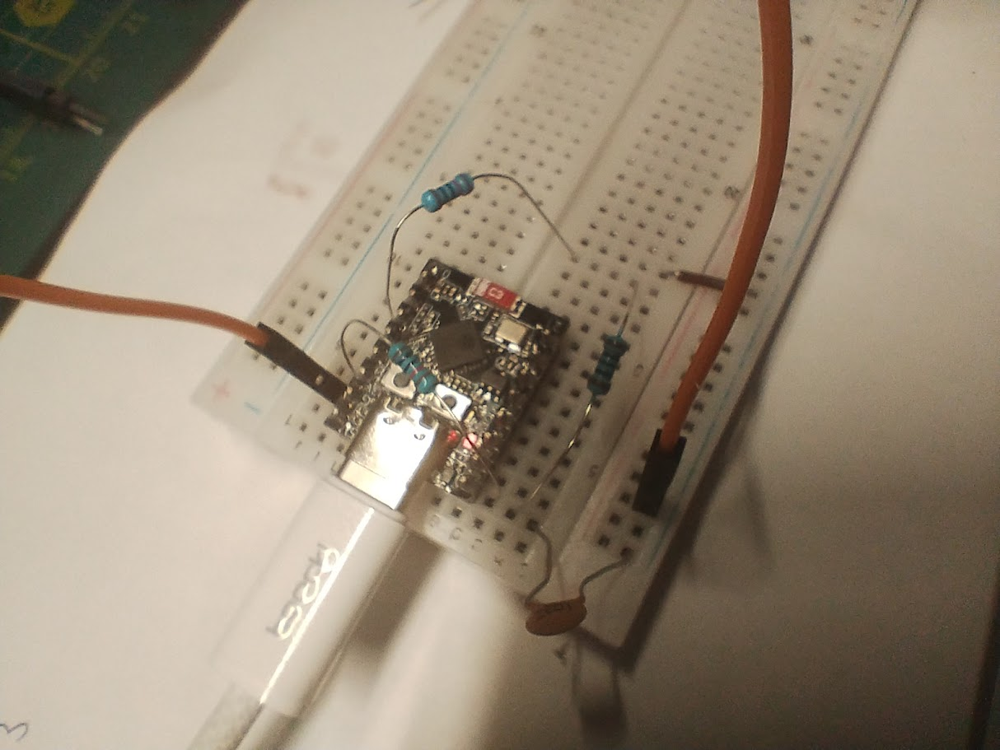
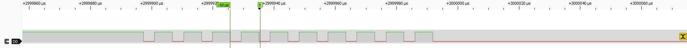
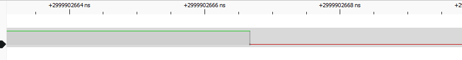
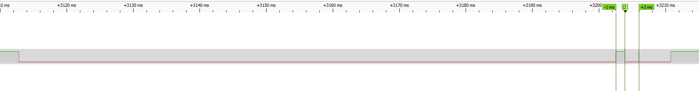
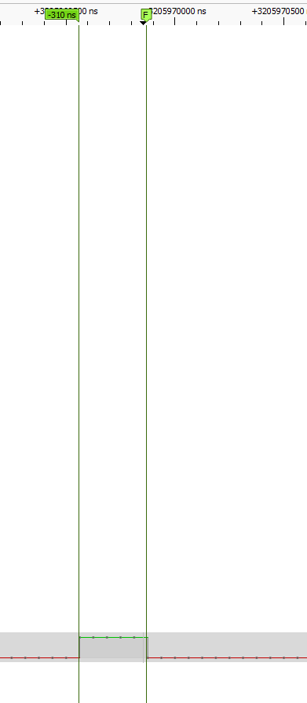

# Workshop 2-4: Hardware Interrupts & Button Debounce
- [Workshop 2-4: Hardware Interrupts \& Button Debounce](#workshop-2-4-hardware-interrupts--button-debounce)
  - [Task 1: No debounce — baseline](#task-1-no-debounce--baseline)
  - [Task 2: Time-based software debounce](#task-2-time-based-software-debounce)
  - [Task 3: State-based debounce (level check)](#task-3-state-based-debounce-level-check)
  - [Task 4: Polling + state-machine debounce (no interrupts)](#task-4-polling--state-machine-debounce-no-interrupts)
  - [Task 5: Hardware RC filter](#task-5-hardware-rc-filter)
    - [Emulated bounce (test RC)](#emulated-bounce-test-rc)
    - [Real button measurements](#real-button-measurements)
  - [Task 6: Comparison](#task-6-comparison)

---

## Task 1: No debounce — baseline

Code: [src/Task1.h](src/Task1.h)

GPIO5 configured with `NEGEDGE` interrupt. ISR increments a counter; `loop()` prints it whenever the value changes.

**Result:** 2–3 extra counts per press. Some triggers also fire on release.

---

## Task 2: Time-based software debounce

Code: [src/Task2.h](src/Task2.h)

ISR records the timestamp via `esp_timer_get_time()` and sets a `_pendingIrq` flag.  
`loop()` ignores the event if less than 50 ms has passed since the last accepted one.  
Uses `portENTER_CRITICAL` to safely read the 64-bit timestamp on a 32-bit CPU.

**Result:** ~1 extra count per press. Occasional spurious trigger on release remains.

---

## Task 3: State-based debounce (level check)

Code: [src/Task3.h](src/Task3.h)

ISR only sets a flag. `loop()` checks `gpio_get_level()` before accepting the event — if the pin is already HIGH again, the interrupt was bounce or release noise and is discarded. Time guard (50 ms) added on top.

**Result:** Release no longer triggers a count. Rare spurious count (~1) still possible on release under noisy conditions.

---

## Task 4: Polling + state-machine debounce (no interrupts)

Code: [src/Task4.h](src/Task4.h)

Interrupts disabled entirely. `loop()` samples GPIO5 every 5 ms.  
State machine: `RELEASED → PRESS_DEBOUNCE → PRESSED → RELEASE_DEBOUNCE → RELEASED`.  
Any bounce during a debounce window restarts that window.

**Result:** Exactly 1 count per press, 0 false triggers. Most stable approach; ~5–10 ms reaction latency.

---

## Task 5: Hardware RC filter

Code: [src/Task5.h](src/Task5.h)

Circuit: `GPIO2 --[100Ω]--> node --[100nF]--> GND`, node connected to `GPIO5`.  
`τ = RC = 100 Ω × 100 nF = 10 µs`.

### Emulated bounce (test RC)

Within this task i emulated button bounce programmatically: GPIO2 toggles 10× with 2 µs / 5 µs contact/return pulses, then settles. An `ANYEDGE` ISR on GPIO5 records every edge timestamp. The same sequence is run without the capacitor (direct wire) and with it.





```text
WITHOUT CAPACITOR
press bounce:   20 edges [+3us, +7us, +12us … +91us]
press settle:   1  (ideal=1)
release bounce: 20 edges [+3us, +7us, +12us … +92us]
release settle: 1  (ideal=1)
total: 42  (ideal=2)

WITH CAPACITOR
press bounce:   0 edges
press settle:   1  (ideal=1)
release bounce: 0 edges
release settle: 1  (ideal=1)
total: 2  (ideal=2)
```

RC filter eliminates all bounce edges for the emulated signal (7 µs pulses). 

Real button peaks up to ~1.4 ms are wider than 5τ = 50 µs, so a larger RC (e.g. 1 kΩ × 100 nF → τ = 100 µs) would be needed for full suppression on a real mechanical button.


### Real button measurements
- Release produces peaks of 600 µs – 1400 µs duration, not filtered out
- Sub-microsecond peaks (~310 ns) also observed, but filtered out




---

## Task 6: Comparison

| Method                   | False triggers                                        | Reaction latency | Complexity                          | Notes                                                                                                                 |
| ------------------------ | ----------------------------------------------------- | ---------------- | ----------------------------------- | --------------------------------------------------------------------------------------------------------------------- |
| No debounce              | 1–2 per press + on release                            | Immediate        | Trivial                             | Unusable for counting                                                                                                 |
| Time-based SW            | ~1 per press                                          | Immediate        | Low                                 | 64-bit read needs critical section on ESP32                                                                           |
| State-based SW           | ~0 (rare edge case on release)                        | Immediate        | Low                                 | Level check in loop() eliminates release noise, but not fully                                                         |
| Polling + state machine  | 0                                                     | slower           | Medium                              | Most robust pure-SW solution                                                                                          |
| Hardware RC (100R/100nF) | 0 for fast bounce (<50 µs) + still present on release | Immediate        | Medium HW (HW specific), Trivial SW | Insufficient for real button peaks >50 µs; larger RC needed, event with other R i cannot remove ISR on button release |
