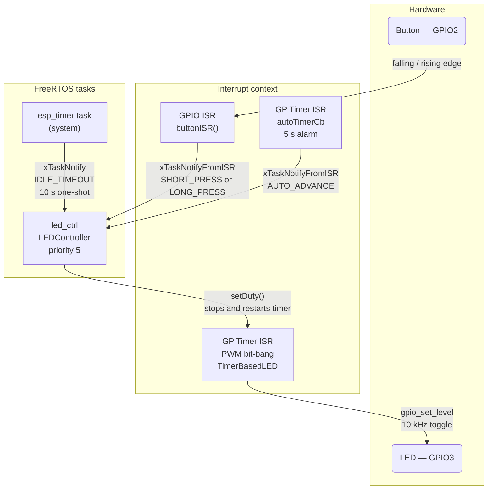
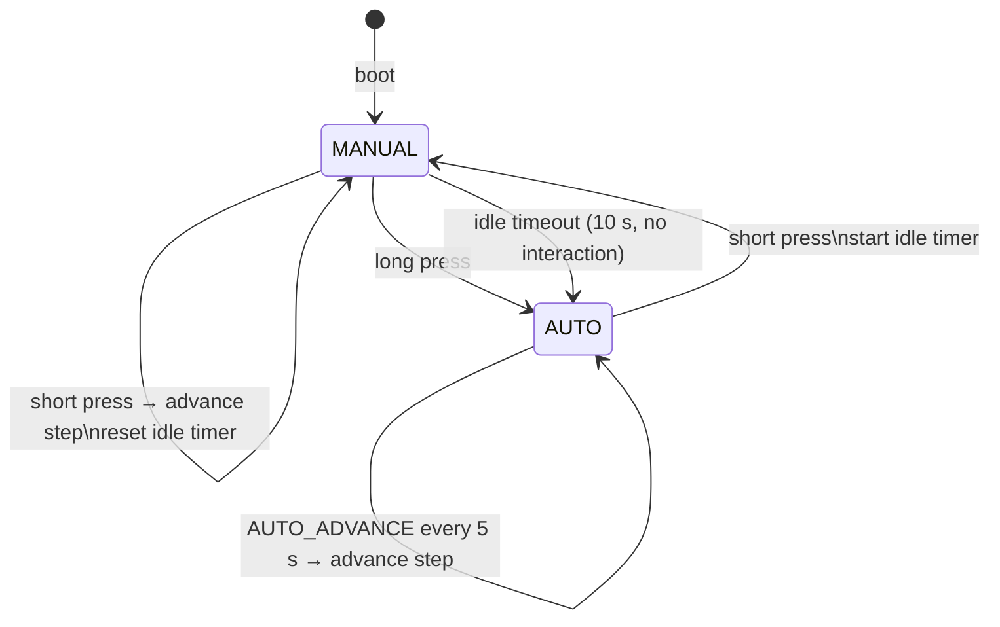

# Workshop 2-mini-project

Use ESP-IDF framework.

## Target Boards

- ESP32-C3 DevKitM-1
- ESP32-S3-DevKitC-1

## Pins
### C3
| Pin   | Function                              |
| ----- | ------------------------------------- |
| GPIO3 | LED (active LOW)                      |
| GPIO2 | Button (active LOW, internal pull-up) |

### S3
| Pin    | Function                              |
| ------ | ------------------------------------- |
| GPIO10 | LED (active LOW)                      |
| GPIO8  | Button (active LOW, internal pull-up) |

## Task

Create an app that controls LED brightness via PWM using timer ISRs and a button:

### PWM

- PWM signal on GPIO3, generated by **GP timer ISR** (bit-bang via GPIO toggle in ISR)
- Frequency: **10 kHz** (defined in `config.h`)
- Predefined duty cycle steps: **0%, 25%, 50%, 75%, 100%**

### Button (GPIO2)

- Button ISR only — no GPIO polling in the main loop
- ISR is minimal and fast (sets a flag / posts to a queue)
- **Short press**: advance to next duty cycle step; if in auto mode, switch back to manual mode
- **Long press**: enter auto mode (also enable auto mode after 10 seconds in Manual mode without changes)

### Modes

| Mode   | Behavior                                                                                         |
| ------ | ------------------------------------------------------------------------------------------------ |
| Manual | Short press cycles duty cycle forward through predefined steps                                   |
| Auto   | Duty cycle advances one step every **5 seconds** using a GP timer; short press returns to manual |

### Implementation Constraints

- All GPIO events handled via ISR — no polling in the super loop
- ISRs are minimal: post to FreeRTOS queue or set atomic flag, defer work to a task
- PWM generated via GP timer ISR (not LEDC hardware peripheral)
- Auto-mode 5 s cadence driven by a separate GP timer
- use ESP-IDF Task Notifications for passing data from ISR to Tasks 

## Solution

### Files:

- `GPTimerBasedLed.hpp` — encapsulates PWM generation via the `gptimer` driver API (the primary implementation used by the app).
- `RegistersBasedLed.hpp` — **just AI-generated to understand how it would look like. (I haven't figured out with all things though )** Shows how the same 10 kHz software PWM can be implemented using direct TIMG register access instead of the gptimer API. Also demonstrates the dual-board pattern: the same class compiles for both ESP32-C3 and ESP32-S3 by mapping Timer Group 1 T0 registers at the correct base address per target — useful to read alongside `GPTimerBasedLed` to understand what the driver abstracts away.
- `LEDController.hpp` (single-file class) — encapsulates LED state management and drives the manual/auto state machine.
- `main.cpp` — pin definitions, hardware init, task bootstrapping.
- `Config.hpp` — all compile-time constants (frequency, duty steps, timeouts).
- `Button.hpp` — GPIO ISR and debounce logic.

### Task & ISR Architecture

### LED Controller State Machine

