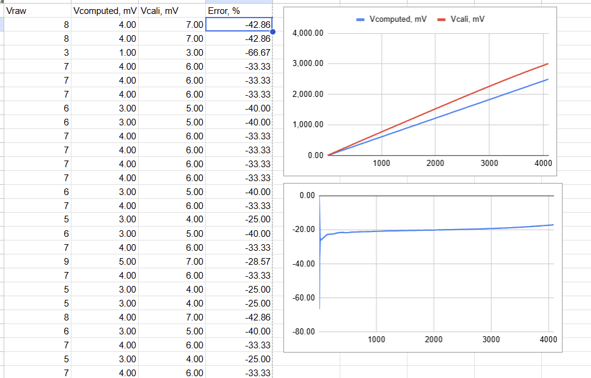
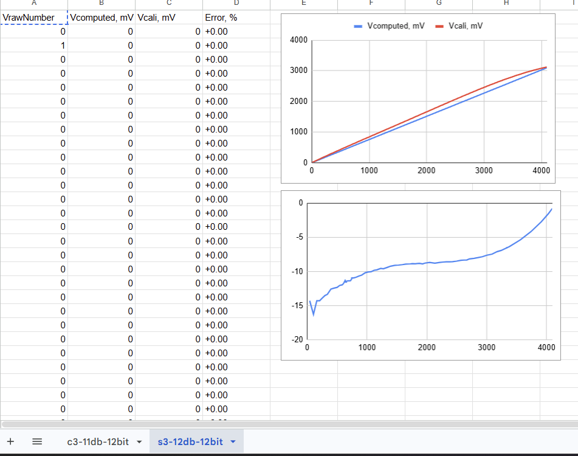

# Workshop 3-1. Калібрування даних з ADC

Use ESP-IDF framework (ESP32-C3 DevKitM-1).

## Solution

Reads ADC_CHANNEL_2 every 100 ms and compares two voltage estimates:

- **Computed** — simple linear formula: `V = raw × V_ref / 4095`
- **Calibrated** — ESP-IDF `adc_cali_raw_to_voltage()` (curve-fitting on both C3 and S3)

The error column shows that the linear formula consistently underestimates by ~17–43%, confirming the necessity of hardware calibration for accurate ADC readings.

### ESP32-C3 (ADC_ATTEN_DB_11, V_ref = 2500 mV)

### ESP32-S3 (ADC_ATTEN_DB_12, V_ref = 3100 mV)

