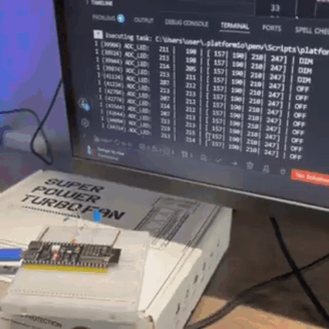

# Workshop 3-2. Converting raw ADC data to degrees and meters: formulas, tables, and accuracy

## Task

- Connect an LDR to the ESP32 as a voltage divider; wire its output to an ADC1 channel.
- Connect an LED to any available GPIO.
- Read ADC values in oneshot mode.
- Implement a Simple Moving Average (SMA) to filter the light readings.
- Use the filtered data to drive the LED: turn it **on** when it gets dark, turn it **off** when it gets bright.
- Prevent flickering with a two-threshold **hysteresis**: the LED must not toggle on small fluctuations in light level.

## Demo

[Video](https://drive.google.com/file/d/1m7tPfyCJN-DQVr1zhL4lkpTcfoaOScBn/view?usp=drive_link)

## Solution

- **[ADC.hpp](src/hardware/ADC.hpp)** — oneshot driver + curve-fitting calibration; exposes `readRaw()`, `toMv()`, and `errorPct()` to compare linear vs. calibrated voltage.
- **[Sma.hpp](src/Sma.hpp)** — ring-buffer SMA template `Sma<N>`; warms up gradually (divides by actual count) so the first output is not pulled toward zero.
- **[Ranges.hpp](src/Ranges.hpp)** — tracks observed `[min, max]` over the session; two fixed thresholds form the hysteresis band; logs whenever the range expands.
- **[PWM.hpp](src/hardware/PWM.hpp) / [Led.hpp](src/hardware/Led.hpp)** — LEDC at 20 kHz / 10-bit; `LED::power(%)` maps 0–100 % to duty cycle.
- **[main.cpp](src/main.cpp#L17)** — `calculateDim` inverts brightness (100 % in dark → 0 % in bright); `lastSmoothed` guard skips PWM writes when the SMA output is unchanged; loop runs at 10 ms / ~100 Hz.