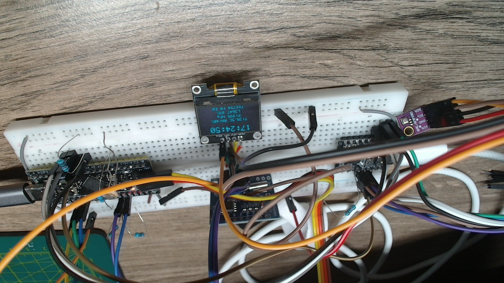
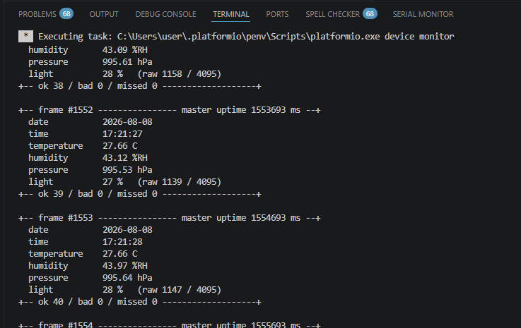

Module 4.4 and 4-5. SPI: Fast data transfer for displays and memory cards (Master/Slave)

## Tasks
1. ON STM32
   1. Read from the BME280 (In our case it will be I2C): temperature (°C), humidity (%RH), pressure (hPa).
   2. Add three new fields to the existing OLED screen output (previous homework): T, RH, P (for example: T: 23.4°C RH: 45% P: 1013 hPa).
   3. Refresh the BME280 data at least once per second (a separate timer/timestamp is fine), without delay().
2. On ESP-C3
   1. Develop your own custom SPI data transfer protocol that transmits date, time, temperature, light level percentage, humidity and pressure.
   2. On the ESP32, implement reception of this data. Parse it into separate variables and print it in a nice format to the serial monitor.
   3. Output received data to serial port
   4. No SD card is connected to ESP-C3 - received output just only to Serial
3. MAKE ESP-C3 to be SLAVE and STM to be MASTER
   1. Use only synchronous communication (no circular DMA transferring or async transmissions) between ESP and STM
4. Wiring: reuse the wiring from ../workshop-4-miniproject (take that project as the starting point)
   1. Additionally, a BME280 will be added to the Tiny RTC and OLED on the same I2C bus

---

# Implementation



*Both boards running. The OLED (upside down in the shot) shows the whole frame:
`17:24:50`, `T:28.5C RH:40%`, `P:995 hPa`, `L3647 89%`, and `TX1754 F0 E0` —
1754 telemetry frames sent, zero SPI failures, zero OLED I2C failures. The
purple GY-BME280 is the module on the right, sharing the I2C bus with the RTC
and the display.*

Two firmwares, built and flashed separately, joined by one SPI link and one
shared header.

| directory | board | role |
| --- | --- | --- |
| [`stm/workshop-4-4/`](stm/workshop-4-4/) | STM32F401CCU6 ("black pill") | I2C application + **SPI master** — reads every sensor, draws the OLED, sends the telemetry frame |
| [`espc3/`](espc3/) | ESP32-C3 | **SPI slave** — receives the frame, parses it, prints it to the serial monitor |
| [`protocol/`](protocol/) | — | [`telemetry_packet.h`](protocol/telemetry_packet.h): the wire format, **compiled by both** |

Roles are reversed from [`../workshop-4-miniproject`](../workshop-4-miniproject),
which this project starts from: there the ESP32-C3 was the master polling STM32
log-slaves over free-running circular DMA. Here the STM32 clocks, the ESP32
listens, and the transfer is a single blocking `HAL_SPI_Transmit`
([`send_frame()`](stm/workshop-4-4/Src/telemetry_link.c#L120-L138)) — no DMA
anywhere on the link.

## Wiring

Unchanged from the mini-project — the same four wires, plus the BME280 joining
the existing I2C bus. Reversing master/slave does **not** move MOSI and MISO:
those names describe the master's role, not the pin's owner, so MOSI still
meets MOSI. What changes is who drives what.

```
        STM32F401 (master)                     ESP32-C3 (slave)
   PA4  CS   ──────────────────────────────►  GPIO7  CS
   PA5  SCK  ──────────────────────────────►  GPIO4  SCLK
   PA7  MOSI ──────────────────────────────►  GPIO6  MOSI   ← the data
   PA6  MISO ◄──────────────────────────────  GPIO5  MISO   (unused, one-way)
        GND  ─────────────────────────────────  GND

   I2C1 bus (PB6 = SCL, PB7 = SDA), 100 kHz, four devices:
        0x3C  SSD1306 OLED 128x64
        0x50  AT24C32 EEPROM   ┐ both on the "Tiny RTC" breakout; the EEPROM is
        0x68  DS1307 RTC       ┘ present on the bus but unused by this firmware
        0x76  BME280           ← new (0x77 if the module's SDO is tied high;
                                 the driver probes both)

   PA0  photoresistor divider -> ADC1_IN0
   PC13 on-board LED — blinks on each frame sent
   GPIO8 on the ESP — blinks on each frame received
```

## The link

One frame per second, one CS assertion per frame, 32 bytes.

Mode 0 (CPOL=0, CPHA=0), MSB first, SCK = PCLK2 / 16 = 16 MHz / 16 = **1 MHz**.
So one frame is 32 × 8 = **256 clocks ≈ 256 µs**, sent once a second — the
picture below is a ~0.26 ms window, and the bus is idle the other 99.97 % of the
time.

```
 CS   ‾‾‾‾╲___________ low for the whole frame ____________╱‾‾‾‾
 SCK  _____╱╲╱╲╱╲╱╲······ 256 clocks, 256 µs ······╱╲╱╲╱╲╱╲_____
 MOSI ─────< A5 5A 01 1A ><··· 26 payload bytes ···>< crc lo,hi >
 MISO ────────── never driven; the link is one-way ─────────────
      time ────────────────────────────────────────────────────→
```

SCK idles low and the first edge is rising (CPOL=0), so the slave samples on
each rising edge. `crc` is a `uint16_t` and both ends are little-endian, so the
**low byte goes out first** — a real frame captured from the host round-trip
test ends `... 19 15` for a CRC of `0x1519`:

```
A5 5A 01 1A  1A 08 08 0E 20 07 3D 00 2E FB B3 11 CD 8B 01 00 C1 09 8B A4 00 00 2A 00 00 00  19 15
└─ header ─┘ └──────────────────────── 26 payload bytes ─────────────────────────────────┘ └ crc ┘
```

Because the frame is fixed-size and CS brackets exactly one of them, the
receiver never has to scan for a packet boundary — the chip-select line *is*
the framing. That is the main simplification over the mini-project's
self-synchronising byte stream, and it is what makes a synchronous link
practical here.

### Frame layout

Defined once, in
[`TelemetryPayload` / `TelemetryFrame`](protocol/telemetry_packet.h#L71-L103).
Little-endian, no padding (`__attribute__((packed))`, checked by a
[`static_assert`](protocol/telemetry_packet.h#L109-L117) on both ends).

| off | size | field | meaning |
| --- | --- | --- | --- |
| 0 | 1 | `magic0` | `0xA5` |
| 1 | 1 | `magic1` | `0x5A` |
| 2 | 1 | `version` | `0x01` |
| 3 | 1 | `payloadLen` | `26` |
| 4 | 1 | `year` | 2000-based (26 = 2026) |
| 5 | 1 | `month` | 1..12 |
| 6 | 1 | `day` | 1..31 |
| 7 | 1 | `hour` | 0..23 |
| 8 | 1 | `minute` | 0..59 |
| 9 | 1 | `second` | 0..59 |
| 10 | 1 | `lightPct` | **light level percentage**, 0..100 |
| 11 | 1 | `flags` | which sources are fresh this second |
| 12 | 2 | `tempC100` | **temperature**, °C × 100, signed |
| 14 | 2 | `humidity100` | **humidity**, %RH × 100 |
| 16 | 4 | `pressurePa` | **pressure**, Pa (÷100 → hPa) |
| 20 | 2 | `lightRaw` | raw 12-bit ADC average, 0..4095 |
| 22 | 4 | `uptimeMs` | master's `HAL_GetTick()` at build time |
| 26 | 4 | `seq` | monotonic frame counter |
| 30 | 2 | `crc` | CRC-16/CCITT-FALSE over bytes 0..29 |

Design notes that are easy to get wrong and are worth stating:

- **Fixed size, not variable.** An ESP32 SPI slave transaction is armed with a
  length *before* the master starts clocking, so a variable-length frame would
  need either a worst-case-sized transaction or a two-transaction
  header/body handshake. Everything here is known at compile time.
- **Scaled integers, not floats.** Neither MCU has an FPU enabled in this
  build; `°C × 100` is exact, endian-trivial and half the width.
- **One header, not two mirrored copies.** The mini-project kept the wire
  format in [`LogProtocol.hpp`](../workshop-4-miniproject/espc3/src/LogProtocol.hpp)
  and hand-mirrored it in
  [`log_emission.c`](../workshop-4-miniproject/stm/miniproject-4/Src/log_emission.c),
  with a "keep the two in sync" comment doing the load-bearing work. Here
  [`protocol/telemetry_packet.h`](protocol/telemetry_packet.h) is on the include
  path of both builds, so a layout change cannot be applied to only one end.
- **[`flags`](protocol/telemetry_packet.h#L52-L54) distinguishes stale from
  wrong.** A sensor that failed this cycle keeps its previous value in the frame
  and clears its bit ([`build_frame()`](stm/workshop-4-4/Src/telemetry_link.c#L74-L118)),
  so the receiver prints "last known" instead of a plausible-looking `0.0`.

## What each end does

### STM32 — [`stm/workshop-4-4/`](stm/workshop-4-4/)

Non-blocking [main loop](stm/workshop-4-4/Src/main.c#L129-L142), one `*_Poll()`
per module, no `HAL_Delay()` anywhere after boot:

- [`sensor_stream.c`](stm/workshop-4-4/Src/sensor_stream.c) — the only code that
  touches a sensor. Light via ADC1 + TIM2 + circular DMA (averaged 20×/s), the
  DS1307 once a second, the **BME280 once a second**
  ([`poll_env()`](stm/workshop-4-4/Src/sensor_stream.c#L106-L133)). The BME280
  runs in NORMAL mode with a 500 ms standby, so a read is one 8-byte I2C burst
  against an already-finished measurement — there is no wait-for-conversion in
  the loop.
- [`telemetry_link.c`](stm/workshop-4-4/Src/telemetry_link.c) — builds the frame
  from those published values and clocks it out. 32 bytes at 1 MHz is ~256 µs of
  blocking, two orders of magnitude under the OLED flush that shares the same
  loop.
- [`display_ui.c`](stm/workshop-4-4/Src/display_ui.c) — the OLED frame, now six
  lines including the three new ones
  ([`format_env()`](stm/workshop-4-4/Src/display_ui.c#L121-L143)).
- [`bme280.h`](stm/workshop-4-4/Inc/bme280.h) — header-only driver:
  [probes 0x76 then 0x77](stm/workshop-4-4/Inc/bme280.h#L305-L324), verifies the
  chip ID (0x60 — a pin-compatible BMP280 reports 0x58 and has no humidity),
  reads both calibration blocks and runs Bosch's integer compensation.

Screen:

```
        12:34:56              <- DS1307, scale 2
   0x3C 0x50 0x68 0x76        <- I2C bus scan (every 10 s)
      T:23.4C RH:45%          <- NEW, BME280
        P:1013 hPa            <- NEW, BME280
        L1003 61%             <- light, raw + percent
       TX120 F0 E0            <- frames sent / SPI failures / OLED I2C failures
```

`TX` counts frames the master *sent*. The link is one-way, so it cannot know
whether the slave was armed to receive them — gaps only show up on the ESP32's
console, as jumps in the sequence number.

### ESP32-C3 — [`espc3/`](espc3/)

One `spi_slave_transmit()` with `portMAX_DELAY`, in a loop
([`SpiSlave::receive()`](espc3/src/hardware/SpiSlave.hpp#L123-L148), driven from
[`app_main`](espc3/src/main.cpp#L141-L184)). That is the whole receive path;
[`TelemetryPrinter`](espc3/src/TelemetryPrinter.hpp) turns a validated payload
into the console block.

The one subtlety of an SPI slave is *arming*: the hardware receives into a
buffer the driver was given in advance, so a frame that arrives while nothing
is armed is not captured at all — it leaves no trace but a gap in the sequence
numbers. The infinite timeout is what keeps exactly one transaction armed at a
time; with a finite timeout, a queued transaction stays armed in hardware and
the next call stacks another behind it.

**[`SPI_DMA_CH_AUTO`](espc3/src/hardware/SpiSlave.hpp#L53-L84) is not optional
here.** `SPI_DMA_DISABLED` was tried first, to keep DMA off the link entirely,
and it produces exactly one good frame — the first after boot — then permanent
garbage. The cause is in the driver, not on the wire:
`spi_slave_queue_trans()` doesn't arm the hardware, it only queues and enables
the interrupt, and the ISR's re-arm path branches on DMA. The no-DMA branch
never resets the RX FIFO and skips `restore_cs()`. Only the very first
transaction escapes it, because `spi_slave_initialize()` armed that one on
freshly reset hardware. See [Faced problems](#faced-problems) below.

This still satisfies "synchronous only": nothing is circular or free-running,
one transaction exists at a time, the call blocks until it completes, and one
frame is one CS assertion. DMA is only how the driver moves 32 bytes during a
call we are already waiting inside — and the STM32 master uses no DMA at all.

Serial output, once per second:



*Consecutive frames #1552, #1553, #1554 — one per second, `bad 0 / missed 0`.
The running counters are the proof the link is healthy rather than merely
alive: `missed` would climb the moment a frame arrived while the slave was not
armed.*

`bad` (bytes arrived and failed validation — wiring, clock rate, version skew)
and `missed` (a hole in the sequence numbers — nothing arrived at all) are
counted apart, because they are different problems with different fixes.

## Build and flash

**ESP32-C3** — PlatformIO CLI lives at `~/.platformio/penv/Scripts/pio.exe`
(not on PATH). From inside [`espc3/`](espc3/):

```sh
pio run                 # build
pio run -t upload       # flash
pio device monitor      # USB console @ 115200 — this is where the frames print
```

**STM32** — open [`stm/workshop-4-4/`](stm/workshop-4-4/) in STM32CubeIDE and
build `Debug` (device STM32F401CCUX). The build needs the include path
`../../../protocol`, which is already in
[`.cproject`](stm/workshop-4-4/.cproject).
[`workshop-4-4.ioc`](stm/workshop-4-4/workshop-4-4.ioc) matches the code, so
re-running CubeMX will not silently put SPI1 back into slave mode.

**Verified on hardware** — both screenshots above are from a running rig:
frames arriving once a second with `bad 0 / missed 0` on the ESP32 console, and
`TX1754 F0 E0` on the OLED (1754 frames sent, no SPI or I2C failures). Off the
bench: `pio run` succeeds, all [`Src/*.c`](stm/workshop-4-4/Src/) compile clean
under `arm-none-eabi-gcc -Wall -Wextra`, and the shared header round-trips on
the host (seal → parse, single-bit flip caught by the CRC,
`sizeof(TelemetryFrame) == 32`).

Still unverified: the BME280 readings have not been checked against a reference
thermometer or barometer, so the *plumbing* is proven but the *calibration* is
only as good as Bosch's compensation formulas being transcribed correctly.

## Faced problems

**One perfect frame, then permanent garbage.** The big one. The link delivered
frame #1171 flawlessly — correct date, temperature, humidity, pressure, CRC —
and then every following transaction arrived as a tiny, *non-byte-aligned*
fragment: 3 bits, 41 bits, 6 bits, 21 bits, with junk data.

The non-byte-aligned counts were the clue that saved the day. A bad wire
dropping SCK edges would still produce roughly the right total; fragments
ending mid-byte mean the peripheral is being restarted underneath the transfer.
So it was software, not the rig.

It turned out to be the ESP-IDF slave driver, in the configuration chosen
specifically to honour the "no DMA" rule. `spi_slave_queue_trans()` does not arm
the hardware — it queues the transaction and calls `esp_intr_enable()`. Arming
happens **only inside the driver's ISR**, whose re-arm path branches on DMA
(`spi_slave.c`, `spi_intr`):

```c
spi_slave_hal_hw_reset(hal);
s_spi_slave_prepare_data(host);   // no-DMA branch: fifo_reset(tx=true, rx=FALSE)
if (use_dma) restore_cs(host);    // "Only connect the CS ... when slave is ready"
spi_slave_hal_user_start(hal);
```

The no-DMA branch never resets the RX FIFO and skips the CS protection. The
first transaction escapes it only because `spi_slave_initialize()` armed that
one on freshly reset hardware. Fixed by
[`SPI_DMA_CH_AUTO`](espc3/src/hardware/SpiSlave.hpp#L53-L84) — which is still
one blocking transaction at a time, nothing circular or free-running, and the
master has no DMA at all.

*Lesson: one good frame is not a working link.* This failure mode is
particularly nasty because the single perfect frame proves the wiring, SPI mode,
CRC and byte order are all correct — it looks like success.

**Finding it needed the right instrumentation, not more guessing.** Several
plausible theories (a bad wire, clock too fast, mode mismatch, CS bounce) all
fit "short frames" equally well. What discriminated between them was dumping the
**raw bytes plus the bit count**, and reporting bits rather than bytes so a
non-byte-aligned transaction stayed visible instead of being rounded away. That
diagnostic is still in
[`main.cpp`](espc3/src/main.cpp#L71-L92) — it costs nothing on a healthy link,
since it only prints on a rejected frame.

**Ten minutes of missing logs.** Early on the console showed one warning and
then silence for ~10 minutes, which looked like the firmware hanging. It wasn't:
the C3's USB-Serial/JTAG console discards writes when no host is attached, so
everything logged before opening `pio device monitor` is simply gone. Worth
knowing before debugging a "hang" that never happened.

**`trans_len` is not advisory.** The first fix attempted was "ignore the length
and trust the CRC". That cannot work here — without DMA the driver copies out of
the FIFO *bounded by that same counter*
(`spi_ll_read_buffer(hw, rx_buffer, rcv_bitlen)`), so a short count means the
buffer really is short. Reading the driver source settled in minutes what
guessing had not.

**The two-copies-of-the-protocol trap, avoided.** The mini-project kept the wire
format in `LogProtocol.hpp` and hand-mirrored it in `log_emission.c`, with a
"keep the two in sync" comment doing the load-bearing work. Here
[`protocol/telemetry_packet.h`](protocol/telemetry_packet.h) sits outside both
projects and is on the include path of each, so a layout change physically
cannot be applied to only one end.

## Things worth knowing before touching this

- **[`SPI_NSS_SOFT`](stm/workshop-4-4/Src/main.c#L295-L311) is not optional.**
  Hardware NSS output on the F4 toggles CS between *bytes*, not around the
  transfer — the slave would see 32 single-byte transactions instead of one
  32-byte frame, and the framing described above would collapse.
- **CS is parked high in
  [`MX_GPIO_Init`](stm/workshop-4-4/Src/main.c#L386-L412)**, before
  `HAL_SPI_Init`. A floating CS is what corrupted the shared bus in the
  mini-project; the ESP end adds a
  [pull-up](espc3/src/hardware/SpiSlave.hpp#L86-L92) for the window before the
  master's GPIO init has run.
- **1 MHz is a deliberate ceiling, not a maximum.** The STM32 runs on HSI with
  no PLL, so PCLK2 is 16 MHz and the prescaler is /16. Going faster means
  enabling the PLL, which shifts TIM2's ADC pacing and the I2C timing with it.
- **[`ctrl_hum` must be written before `ctrl_meas`](stm/workshop-4-4/Inc/bme280.h#L280-L284)**
  on the BME280 — the chip only applies the humidity oversampling on the next
  `ctrl_meas` write. Get it backwards and humidity reads as a constant, which
  looks like a working sensor with strange values.
- **Do not set the ESP slave back to `SPI_DMA_DISABLED`** to "remove the last
  DMA" — see [Faced problems](#faced-problems).
- **One good frame is not a working link.** That is exactly what the broken
  configuration above produced. Watch the `ok / bad / missed` counters across a
  minute before believing it.
