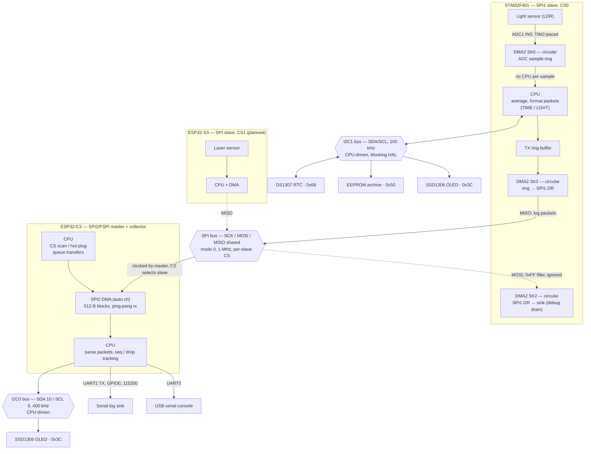

# Faced problems

- failed wire caused wrong data over SPI

# Diagram

Star topology: the ESP32-C3 is the single SPI master / hub, every other node is a
slave on the shared bus with its own CS. Slaves never talk to each other.
Buses are drawn as nodes — everything hanging off one bus node shares the same
physical wires and is selected by address (I2C) or CS (SPI). The log stream is
one-way: slaves push records, the master only clocks the bus.

| link | bus / port | who moves the bytes |
| --- | --- | --- |
| LDR → STM32 | ADC1 IN0, TIM2 trigger | DMA (circular), no CPU per sample |
| STM32 ↔ RTC / EEPROM / OLED | I2C1, one bus, 3 addresses | CPU, blocking HAL |
| STM32 → ESP32-C3 | SPI1 slave, hardware NSS, mode 0 | DMA both ends; CPU only fills / parses buffers |
| ESP32-C3 → sinks | UART1 (GPIO0), I2C0, USB console | CPU |
