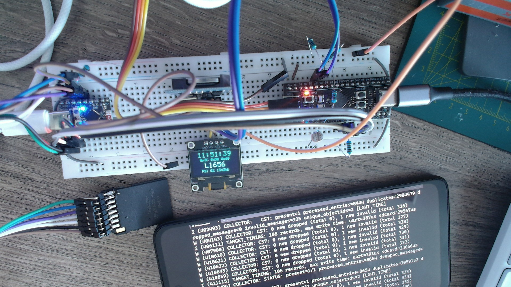
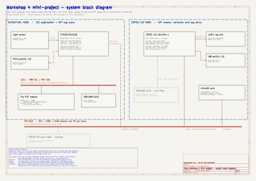

# Workshop 4 mini-project
- NOTE: I make it to work somehow (but with a lot of iterations with the CLAUDE)

# Faced problems

- faced failed wire caused wrong data over SPI
- faced SD card mount on the shared SPI bus failed intermittently (timeout / invalid response / CRC errors) whenever the STM32 slave was powered — its SPI1 uses hardware NSS (CS7), and until the ESP32 collector's first `attach()` that CS pin was left floating, so noise on it could make the STM drive MISO at the wrong time and corrupt the SD card's transactions. Fixed by driving all CS pins high immediately after bus init, before anything else touches the bus; a hardware pull-up on CS/NSS lines is the more complete fix since it also covers the pre-firmware boot window.
- faced DMA circular streaming from STM32 to ESP-C3 via SPI (just to try) causes packets to be split in the middle on ESP32 side 
- for some reason display connected to STM fails to communicate periodically (Errors on screen and reinitialization in the code) 

# Diagram

Star topology: the ESP32-C3 is the single SPI master / hub, every other node is a
slave on the shared bus with its own CS. Slaves never talk to each other.
Buses are drawn as thick lines — everything touching one shares the same
physical wires and is selected by address (I2C) or CS (SPI). The log stream is
one-way: slaves push records, the master only clocks the bus.

Generated, not hand-drawn — see [`kicad/`](kicad/) for the generator and for the
pin-level schematic (`miniproject-4.kicad_sch`) that this block view summarises.

| link | bus / port | who moves the bytes |
| --- | --- | --- |
| LDR → STM32 | ADC1 IN0, TIM2 trigger | DMA (circular), no CPU per sample |
| STM32 ↔ RTC / EEPROM / OLED | I2C1, one bus, 3 addresses | CPU, blocking HAL |
| STM32 → ESP32-C3 | SPI1 slave, hardware NSS, mode 0 | DMA both ends; CPU only fills / parses buffers |
| ESP32-C3 → sinks | UART1 (GPIO0), I2C0, USB console | CPU |
| ESP32-C3 ↔ microSD | same SPI2/FSPI bus, dedicated CS3 | CPU, synchronous (SDSPI + FATFS, no DMA) |
