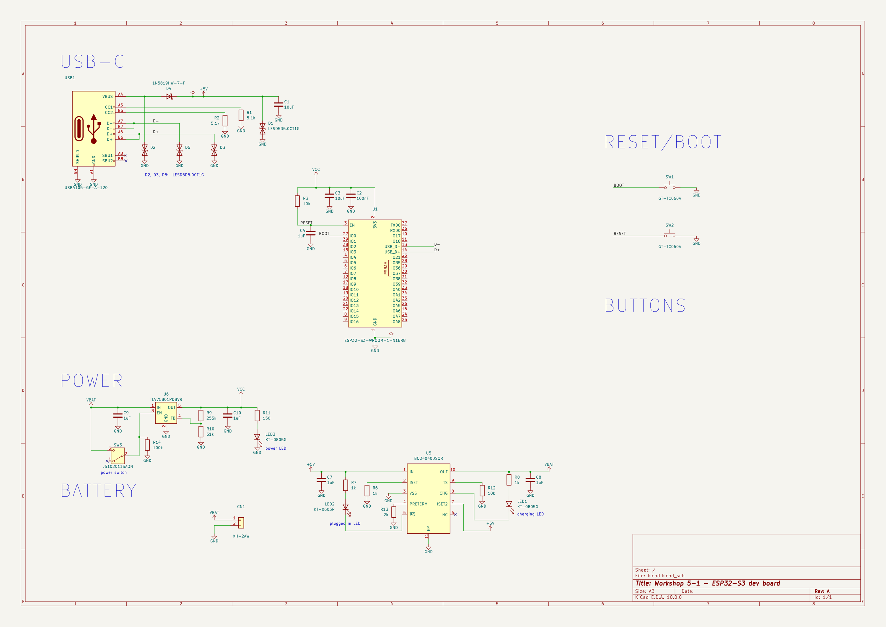

# Workshop 5-1 — ESP32-S3 Dev Board

## 1. Task — Schematic of power supply

Design the power supply for the board: USB-C input, Li-Ion charging, battery
input, and a regulated 3.3 V rail for the ESP32-S3 module.

### Power chain

| Stage | Part | Function |
|-------|------|----------|
| USB-C input | `USB1` USB4105-GF-A-120 + `D4` 1N5819HW-7-F | 5 V bus input with reverse-current Schottky |
| Charger | `U5` BQ24040DSQR | Li-Ion linear charger, 5 V → `VBAT` |
| Battery | `CN1` XH-2AW | Single-cell Li-Ion connector on `VBAT` |
| Switch | `SW3` JS102011SAQN | Power switch on `VBAT` |
| Regulator | `U6` TLV75801PDBVR | Adjustable LDO, `VBAT` → `VCC` |

The LDO output is set by the `R9` / `R10` feedback divider. With
V<sub>FB</sub> = 0.55 V (TLV758P datasheet, eq. 2):

```
VOUT = VFB × (1 + R9 / R10) = 0.55 V × (1 + 255k / 51k) = 3.3 V
```

Charger programming and indication: `R7` (1 k) sets the fast-charge current,
`R6` (1 k) the pre-termination threshold, `R12` (10 k) the TS thermistor
branch. `LED1` shows charging (`CHG`), `LED2` shows USB power present (`PG`),
`LED3` shows the regulated rail is live.

### Schematic

Source file: [kicad/.history/kicad.kicad_sch](kicad/.history/kicad.kicad_sch)
(KiCad project: [kicad/kicad.kicad_pro](kicad/kicad.kicad_pro))


