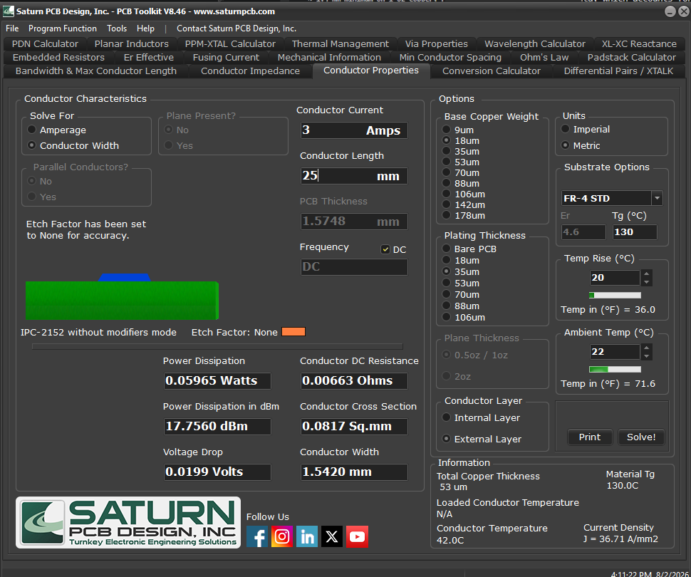
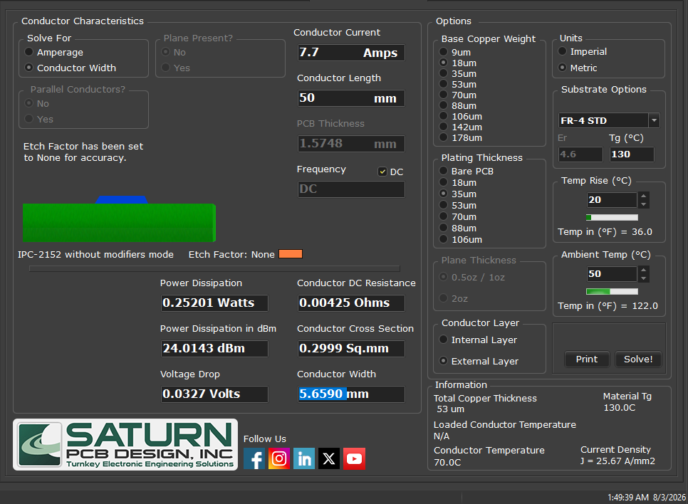

# Tasks 5.3

Яка ширина доріжки живлення необхідна в таких випадках. Поясніть.

## Task 1

Task:
Ви розробляєте плату розширення (HAT) для Raspberry Pi 4 Model B. Плата повинна подавати живлення 5V на контакти GPIO мікрокомп'ютера від зовнішнього джерела. Довжина доріжки: 25 мм

**Solution:**
- PI 4 - max power consumption 7-15 W (taking into account usb ports)
- I = 15W/5V = 3 A
- **Conductor width**: 1.54mm

### Review

- **1.54 mm is sound** — mildly conservative, not unsafe. IPC-2221 for 3 A on 1 oz (35 µm) external copper needs **1.37 mm at ΔT = 10 K** and 0.90 mm at ΔT = 20 K. Your Saturn run used 53 µm total copper (35 µm base + 18 µm plating) at ΔT = 20 K, so it is not a 1 oz result — worth stating alongside the number, since a width without its copper weight and ΔT does not mean anything.
- **The current is right, the justification can be stronger.** Instead of "7–15 W", cite the Pi 4B Datasheet rel. 1.1 §4.1: *"requires a good quality USB-C power supply capable of delivering 5V at 3A"*. The official power-supply docs add: ~600 mA typical bare-board, 1.2 A max for USB peripherals.
- **The HAT design guide sets back-powering through the header at 2.5 A** — that is the figure that actually governs this scenario. 3 A covers it.
- No Raspberry Pi document states a peak/transient board current, which is why designing to the PSU rating is the defensible route.
- **Voltage drop is not the constraint here.** R = 8.8 mΩ, 26 mV one-way at 3 A; with a same-width ground return the loop drop is ~49 mV (~54 mV hot). The HAT design guide states the acceptable input range is 5 V ±5 %, so the trace uses about a third of the budget at worst case. The trace is thermally limited.
- 5 V enters on header **pins 2 and 4** (per the design guide), so the trunk carries the full 3 A and the two stubs ~1.5 A each. Size the trunk.
- **Protection**: the 4B has no input ZVD and no series polyfuse — only an SMBJ5.0A TVS. So there is nothing to "bypass"; the protection simply is not there, and the design guide makes the HAT responsible for an ORing/ideal diode plus overcurrent protection.
- The 40-pin header's per-contact current rating could not be confirmed from any manufacturer datasheet. The commonly repeated "3 A per pin" is unattributed — do not quote it.

## Task 2

Ви проектуєте мініатюрний бездротовий датчик температури в кімнаті на базі ESP32-WROOM-32. Плата має багато елементів, тому доріжки мають бути тонкими, але витримувати пікові навантаження під час передачі даних. Довжина доріжки: 40 мм

**Solution:**
- Minimum current delivered by power supply: 500 mA (from https://www.alldatasheet.com/datasheet-pdf/download/1179101/ESPRESSIF/ESP-WROOM-32.html)
- **Conductor width:** 0.14mm

<!-- TODO: images/Task2.png is byte-identical to the Task 1 screenshot (a Task 1 run:
     3 A / 25 mm / 1.542 mm). Re-run Saturn at 0.5 A / 40 mm and replace it. -->

### Review

- **0.14 mm clears the thermal check but not voltage drop.** The IPC-2221 thermal minimum at 500 mA (1 oz, external, ΔT = 10 K) is 0.115 mm, so 0.14 mm passes. But over 40 mm it is R = 0.171 Ω, dropping **85 mV at 500 mA — 28 % of the entire 3.3 V → 3.0 V tolerance budget**, before anything else on the board takes its share.
- **Recommend 0.20 mm (8 mil)**: 49 mV drop, ~4 K self-heating, 745 mA thermal capacity. It costs nothing to route — economy fab class is 0.15 mm — and the board is a temperature sensor, where self-heating near the sensing element is not free.
- **500 mA is a supply requirement, not a consumption figure.** The datasheet line is *"current delivered by external power supply: 0.5 A min"* under Recommended Operating Conditions. Actual consumption is **239 mA average / 379 mA peak** at 802.11b 19.5 dBm, and 150 µA in deep sleep. That table is absent from the plain WROOM-32 datasheet but present in the identical-silicon WROOM-32E one. Sizing at 500 mA is fine and conservative — just label it correctly.
- **"The burst is too short to heat the copper" does not hold here.** The adiabatic heating rate is ~77 K/s, reaching 10 K in 0.13 s — far shorter than a real radio-on window. Steady-state IPC analysis genuinely applies, so sizing at the peak is correct rather than merely cautious.
- **Local bulk decoupling is what actually permits a thin trace.** The burst charge (0.3 A × 10–50 µs at 100 mV droop) needs 30–150 µF, so Espressif's recommended 10 µF is marginal — and the capacitor must sit at the *module* end of the 40 mm run, not at the regulator.
- Record the copper weight and ΔT behind 0.14 mm; the calculator run that produced it was not saved, so those conditions are currently unknown.
- Prefer the official Espressif datasheet URL over the alldatasheet mirror.

## Task 3

Ви розробляєте контролер для керування розумною світлодіодною стрічкою на базі діодів WS2812B (Neopixel), що буде працювати на вулиці за типового українського клімату круглий рік. До вашої плати підключається стрічка довжиною 2 метри зі щільністю 60 світлодіодів на метр. Довжина доріжки (від клеми живлення до конектора стрічки): 50 мм.

**Solution:**
- WS2812B - maximum of ~60 mA at 5V white light()
- LED_COUNT=60 * 2 = 120
- Total current= 120*0.06 = 7.2A
- Also controller itself: 0.5A
- T -50, +50
- **Conductor width**: 5.6590 mm

### Review

- **Attribute the 60 mA.** The WorldSemi WS2812B datasheet contains **no per-LED drive current spec at all** — 60 mA at full white (3 dies × 20 mA) comes from Adafruit's NeoPixel Überguide. Say so rather than implying it is a datasheet figure.
- 120 LEDs × 60 mA = **7.2 A** worst case is right, and adding 0.5 A for the controller is correct **if** the MCU is fed downstream of this trace rather than tapping at the terminal. State which.
- **Designing for the full 7.2 A with no statistical derating is the right call.** A trace sized by the common "1/3 rule" (2.4 A → 0.66 mm) would see ΔT rise by 3^(1/0.44) ≈ 12× at 7.2 A — roughly a 240 K rise — meaning laminate decomposition and a reflowed connector on the first full-white power-on.
- **"T −50, +50" does not reproduce your arithmetic.** The Saturn run uses a single ambient of +50 °C with a 20 K rise; −50 °C never enters the calculation. For the climate justification: Ukraine's record high is +42 °C (Kyiv +39.9 °C), plus 15–20 K solar gain on a dark enclosure, so **65 °C is the defensible worst-case ambient**. Winter was checked and is *not* the limiting case — ρ falls to ×0.823, roughly cancelled by ~0.1 V more LED headroom.
- **Say which constraint governs.** An independent derivation gives 2.14 mm from thermal alone, but the 50 mV drop budget (with ρ up 22 % at the 76 °C operating point) forces 4.32 mm → **5.0 mm on 1 oz**. Same ballpark as your 5.659 mm, but reached by voltage drop, not heating — that distinction is the interesting part of the answer.
- **5.7 mm is not really a trace.** The practical options are a copper pour/polygon for the 5 V rail, 2 oz copper (≈2.5 mm), or moving the power terminal next to the strip connector so the 50 mm run mostly disappears. Note that ambient alone costs 1.59× more width than the identical indoor board.
- **The chosen LED is marginal for the stated requirement.** WS2812B operating range is −25…+80 °C; Kyiv's absolute minimum is −32.2 °C. Worth flagging in a task that is explicitly about year-round outdoor use in Ukraine.
- 120 LEDs at full white **cannot be fed from one end regardless of board copper** — the strip's own rails drop several volts. Multi-point power injection is mandatory.
