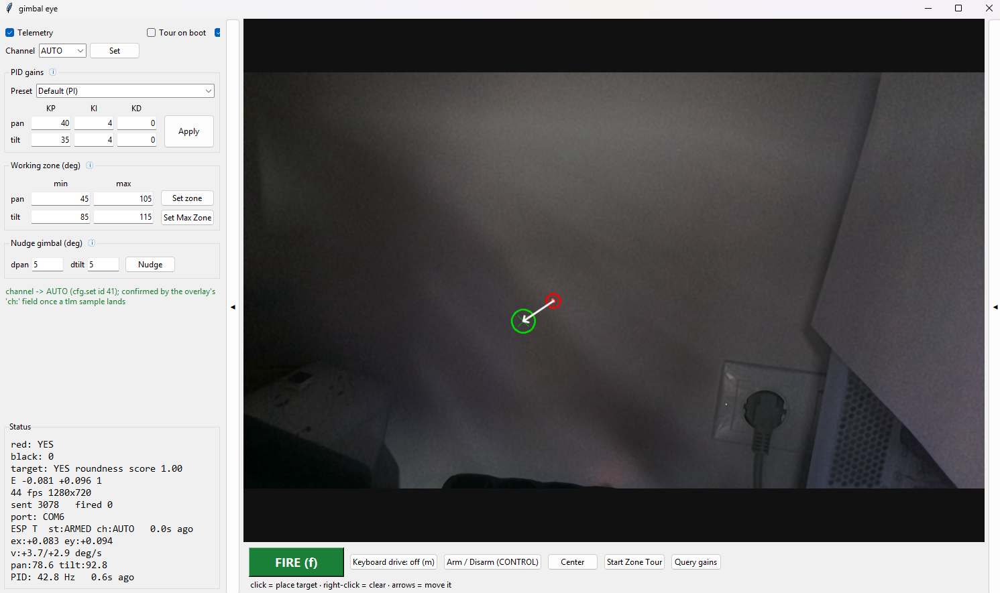
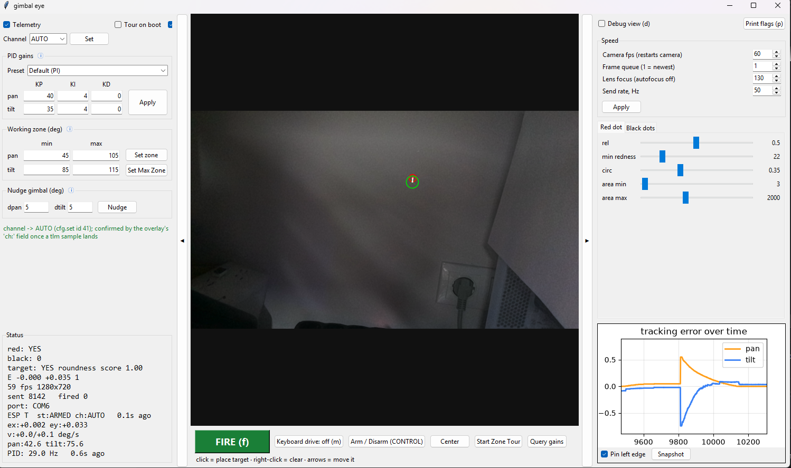

# Final Project — Laser Gimbal with Camera Tracking

> A laser on a 2-axis gimbal that closes its control loop through a camera,
> tracking a target with image-based visual servoing.

## About the project

A PC watches both the laser dot and the target, computes the error vector
between them, and streams it to an ESP32-S3 over UART. The firmware runs one
PID per axis and drives the servos **by velocity**, not position — the same
structure a camera gimbal tracker uses. The gimbal can also be driven by hand
from the PC, and every control step is logged to an SD card.

## Quick Start

Firmware (`AIM`, ESP32-S3, [PlatformIO](https://platformio.org/)):

```bash
git clone <repo-url>
cd workshop-7-final_project/firmware/aim
pio run -e esp32-s3-devkitc-1
pio run -t upload
pio device monitor
```

Vision host (`EYE`, PC, Python 3):

```bash
cd workshop-7-final_project/eye/camera
py -3 -m pip install -r requirements.txt
py -3 tracker.py --port --echo         # port auto-detected
```

## Architecture

`EYE` (PC) detects the red laser dot and the black target dot, computes the
error vector, and sends it to `AIM` (ESP32-S3) over a single UART link. `AIM`
runs the control, storage and safety tasks under FreeRTOS, drives the gimbal
and laser, and logs every step to an SD card. Full task set, link contracts
and wire formats are in [`docs/architecture.md`](./docs/architecture.md).

## Documentation

| File | Contents |
|------|----------|
| [`docs/architecture.md`](./docs/architecture.md) | Node roster and per-board hardware, task set, link contracts, wire formats, storage, control and safety |
| [`docs/diagrams/`](./docs/diagrams/README.md) | Data flow, AIM states and FreeRTOS task diagrams |
| [`docs/interfaces.md`](./docs/interfaces.md) | The authoritative pin map, plus every bus with its speed, its rationale and its failure behaviour |
| [`docs/protocol.md`](./docs/protocol.md) | The wire contract both ends implement: control ASCII, NDJSON, CRC-8 and the config plane |
| [`docs/bringup.md`](./docs/bringup.md) | Flash order, first-boot sequence, OLED and status-LED reference, first-run checklist |
| [`docs/coding.md`](./docs/coding.md) | The firmware rules |

## Technology Stack

- **`AIM`** — ESP32-S3, ESP-IDF via PlatformIO, FreeRTOS, SPI (SD card /
  FatFs), I²C (SSD1306 OLED), UART, PWM (servos, laser)
- **`EYE`** — Python 3, OpenCV, DepthAI (OAK camera), pyserial, matplotlib, Tk
- **Hardware** — KiCad (`AIM` board: ESP32-S3-WROOM-1 DevKit, SG90 servos,
  1-channel relay laser driver)

## Results

TODO: attach video





---

## Author

Vitaly Melnik
