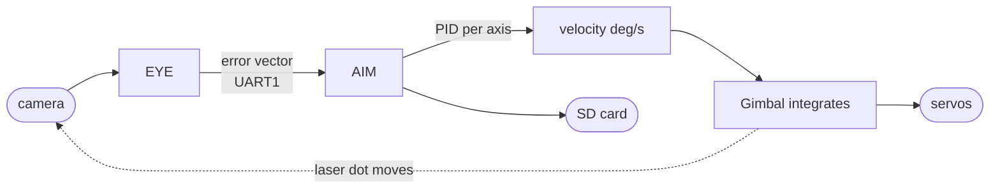
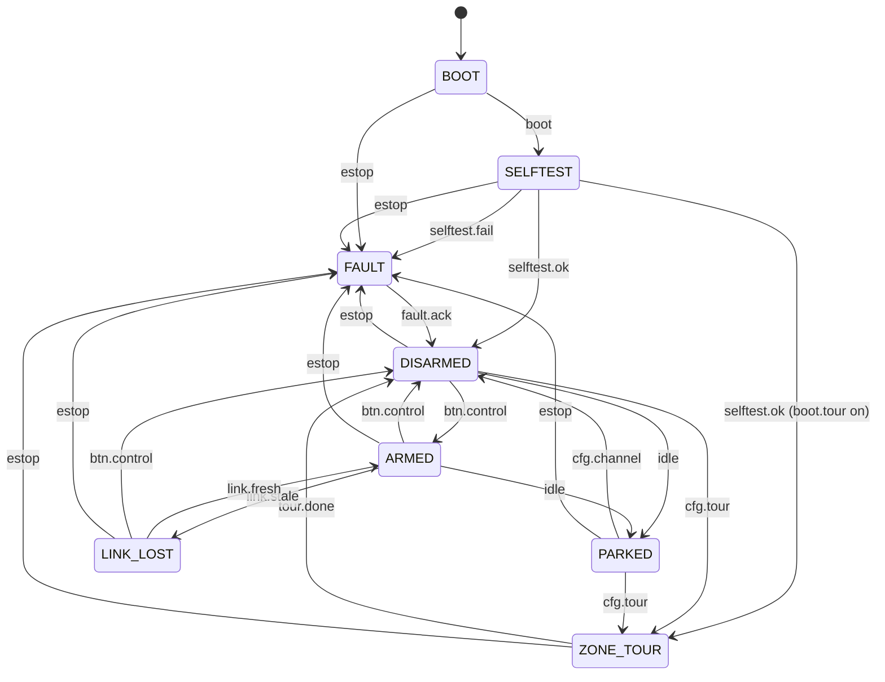

# Diagrams — Laser Gimbal with Camera Tracking

Visual diagrams for the system, extracted from
[`../README.md`](../README.md) and kept here so they can be maintained as
Mermaid sources.

## Data flow

Phase 0 closed loop (`EYE` ↔ `AIM`).

**EYE** (PC) sees · **AIM** (ESP32-S3) decides and acts.

## AIM States

The `ctrl` task FSM (`ctrl` is the sole owner; `trigger` names the token
logged with each transition). Source:
[`StateMachine.hpp`](../firmware/aim/src/StateMachine.hpp),
[`Ctrl.hpp`](../firmware/aim/src/tasks/Ctrl.hpp).

### State legend

| State       | Meaning                                                                          |
| ----------- | --------------------------------------------------------------------------------- |
| `BOOT`      | Power-on, before `SELFTEST` runs. No laser, no motion.                           |
| `SELFTEST`  | Hardware gate — I2C scan, SD mount, servo sweep, camera handshake. Fail goes to `FAULT`. |
| `ZONE_TOUR` | Geometry sweep. Laser lit (no link needed). After `SELFTEST` if `boot.tour` is on, or on demand. Then `DISARMED`. |
| `DISARMED`  | Idle, not driving the gimbal. Laser off. Waits for `btn.control` (arm) or a channel select. |
| `ARMED`     | Closed-loop tracking live. Laser permitted. Motion driven by the selected input channel. |
| `PARKED`    | Idle timeout (30 s) from `DISARMED`/`ARMED` with no channel selected. Servos detached, laser off. |
| `LINK_LOST` | Selected channel stale for over 300 ms. Gimbal stopped, PIDs reset, laser off.    |
| `FAULT`     | Latched by E-stop or self-test failure. Laser forced off; only `fault.ack` clears it. |

Notes:

- The laser is permitted only in `ZONE_TOUR` and `ARMED`
  ([`stateAllowsLaser`](../firmware/aim/src/StateMachine.hpp)); it is forced
  off in every other state.
- `estop` preempts every state except `FAULT` itself — it is checked once per
  20 ms control step, ahead of the rest of the FSM.
- `ARM`/`btn.control` is ignored in `BOOT`, `SELFTEST`, `ZONE_TOUR` and
  `FAULT`.
