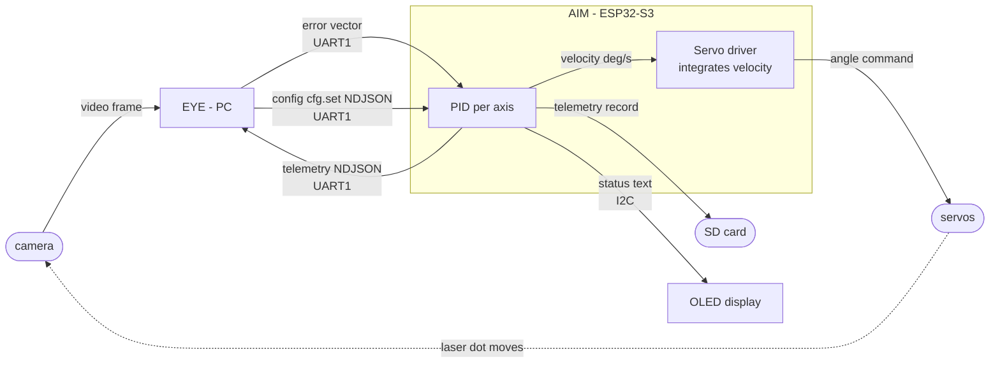

# Data flow

Phase 0 closed loop (`EYE` ↔ `AIM`). Source:
[`architecture.md` §1](../architecture.md#1-nodes),
[§3](../architecture.md#3-communications).

**EYE** (PC) sees · **AIM** (ESP32-S3) decides and acts.
