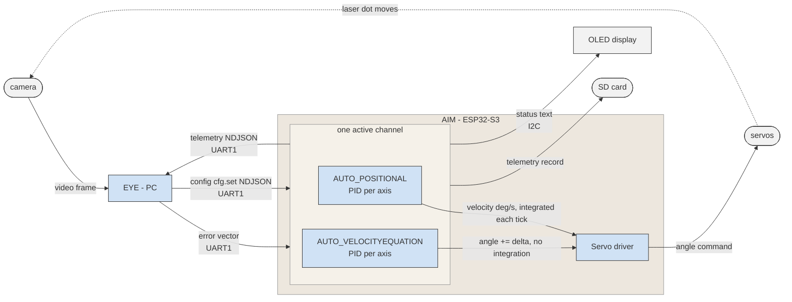

# Data flow

Phase 0 closed loop (`EYE` ↔ `AIM`). Source:
[`architecture.md` §1](../architecture.md#1-nodes),
[§3](../architecture.md#3-communications).

**EYE** (PC) sees · **AIM** (ESP32-S3) decides and acts.

**Exactly one channel is active at a time** ([`architecture.md` §4](../architecture.md#4-input-channels)):
`AUTO_POSITIONAL`'s PID outputs a velocity that `Servo driver` integrates into an
angle every 20 ms tick; `AUTO_VELOCITYEQUATION`'s PID instead outputs an angle
delta added straight onto the current angle, with no separate integration step
— see [`servo-control-strategies.md`](../servo-control-strategies.md). `MANUAL`
and `NONE` (keyboard drive, idle) are omitted here for clarity — same diagram,
different source feeding `GIMBAL`.
