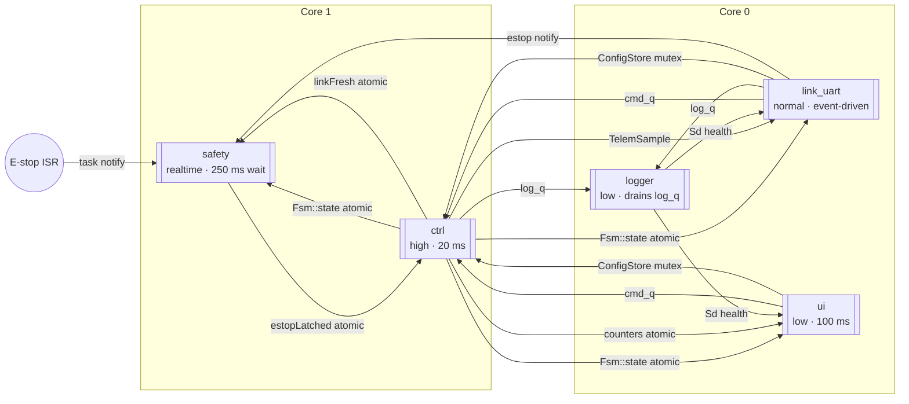

# FreeRTOS tasks — AIM

The `AIM` (ESP32-S3) task set: which core each task runs on, and what
crosses between them. The task table (priority, period, what each task
owns) and the full "what crosses a boundary, and what protects it"
reference are in
[`architecture.md` §2](../architecture.md#2-task-architecture--aim) — this
page is the diagram only.

Reading the diagram: boxes are tasks, grouped by the core they are pinned
to; each arrow is one item from the "what crosses a boundary" table in
`architecture.md` §2, labelled with the queue, mutex or atomic that carries
it.
