# Presentation Draft — Laser Gimbal with Camera Tracking

Draft for the slide template. One `##` header = one slide.
Diagram sources are in [`diagrams/`](./diagrams/) (Mermaid → SVG).

---

## 1. Title

Laser Gimbal with Camera Tracking on ESP32-S3 (FreeRTOS, PID, OpenCV)

| Item | Value |
| --- | --- |
| Student | Vitaly Melnik |
| Group | TODO |
| Course | Embedded Development |
| Defence date | TODO |
| GitHub | TODO: link |

---

## 2. Hook

> We move a laser with servos and watch it with a camera.
> The camera image is **50–250 ms late**.
> With late feedback, the gimbal easily overshoots. How do we fix that?

---

## 3. Problem

| Item | Value |
| --- | --- |
| Task | Put a laser dot on a target, using a camera as feedback |
| Delay | Camera → vision → link takes 50–250 ms. This limits the gain |
| Servos | Deadband, backlash, gravity droop |
| Safety | The laser must not turn on by mistake |
| Scope | Learning project: one UART link, PC does the vision |

---

## 4. Solution — big picture



| Node | Job |
| --- | --- |
| `EYE` (PC) | Sees the laser dot and the target. Sends the error vector |
| `AIM` (ESP32-S3) | Runs 2 PIDs, drives servos, logs to SD |

- Camera is the real feedback. It does not trust the servo angle.
- One UART link, 115200 baud — lowest latency.

---

## 5. Why velocity, not position

PID does not say "go to angle 30°". It says "move this fast".

```text
error → PID → speed → add up every 20 ms → angle → servo
```

| | Position PID | Speed command (ours) |
| --- | --- | --- |
| Error is 0 | Gimbal goes back to centre | Gimbal stays |
| Error is 40 px | Which angle? Unknown | Move that way |
| Safety | Angle can jump | Speed has a hard limit |

- Adding up speed over time is an **integrator**: `P(s) = k/s`.
- `1/s` means "add up over time". 10°/s for 2 s = 20°.
- Result: simple P-only tuning is often enough.

TODO: graph — error vs time for different gains.

---

## 6. Architecture — FreeRTOS tasks



| Task | Core | Note |
| --- | --- | --- |
| `ctrl` | 1 | 20 ms fixed period, PID + servos |
| `safety` | 1 | Highest priority. E-stop and laser gate |
| `link_uart` | 0 | Reads UART, fills `cmd_q` |
| `logger` | 0 | Lowest priority. Only task that may block long |
| `ui` | 0 | OLED + MODE button |

Why: an SD card can stall a write for 100–250 ms. That must never reach `ctrl`.

Source: [`architecture.md`](../architecture.md#2-task-architecture--aim)

---

## 7. Safety — the laser gate



- Laser is allowed only in `ZONE_TOUR` and `ARMED`.
- `laserPermitted()` needs **all**: `ARMED`, link fresh, watchdog OK,
  no E-stop, beam requested.
- No data for 300 ms → `LINK_LOST`, motors stop.
- E-stop: ISR → task notification → `safety`. No work in the ISR.
- Source: [`StateMachine.hpp`](../../firmware/aim/src/StateMachine.hpp)

---

## 8. Implementation — key decisions

| # | Decision | Why |
| --- | --- | --- |
| 1 | Only one input channel at a time: `AUTO` / `MANUAL` / `NONE` | No hidden mixing. Switch resets PIDs, so no jump |
| 2 | Two rate limits: hard limit in `Gimbal`, PID clamp below it | Anti-windup can see the real limit (`static_assert`) |
| 3 | Log queue drops oldest, never blocks | Telemetry may be lost. Control may not |
| 4 | NDJSON + CRC-8, 256-byte line limit, `NaN` rejected | A `NaN` in the PID would break the integrator |
| 5 | Boot zone tour: laser draws the zone clockwise | Wrong direction = wrong axis flag, seen in 4 s |

Code: [`Gimbal.hpp`](../../firmware/aim/src/parts/Gimbal.hpp),
[`Ctrl.hpp`](../../firmware/aim/src/tasks/Ctrl.hpp)

---

## 9. Implementation — code

TODO: pick one 10–20 line snippet.
Good candidates:

- PID clamp + `static_assert` in [`Gimbal.hpp`](../../firmware/aim/src/parts/Gimbal.hpp)
- `laserPermitted()` in [`Safety.hpp`](../../firmware/aim/src/tasks/Safety.hpp)

---

## 10. Problems we faced on the rig

| Problem | Solution | TODO |
| --- | --- | --- |
| Auto aim "blows up": dot runs away. It is a PID control problem, **not solved yet** | Only a workaround: small working zone (60° pan, 30° tilt) keeps the dot in the scene. Boot zone tour shows axis direction. See [`Config.hpp`](../../firmware/aim/src/Config.hpp) | Real fix: PID tuning. Add graph |
| Wrong MIN/MAX angles on the assembled gimbal | Measured on the rig. Direction flags set (more pan = left, more tilt = down). `static_assert` keeps zone inside travel | Add the measured limits |
| Laser blinks at startup | TODO: from `PROBLEMS_FACED.md` | Cause and fix |
| Data stops reaching ESP32 when the PC window is resized | TODO: from `PROBLEMS_FACED.md` | Cause and fix |
| ESP32 resets when PC disconnects UART0 | TODO: from `PROBLEMS_FACED.md` | Cause and fix |

---

## 11. Other problems from design

| Problem | What we did |
| --- | --- |
| Logs and data shared UART0; a line starting with `F` could fire | Data moved to UART1. UART0 is console only. Fire command hardened |
| Relay laser lit at power-on (pin floats) | Set level before output, add pull-up |
| SD card stalls a write for 100–250 ms | Separate low-priority `logger` task, queue drops oldest |
| Camera delay limits gain | Low gains, velocity control, tuning with repeatable nudge |
| Servo deadband and backlash | Camera feedback corrects them |

---

## 12. Open issues

| Issue | State |
| --- | --- |
| Relay power-on defect | Firmware side fixed. Hardware side: TODO |
| No wall clock; `t_wall_iso` is empty | Time is aligned offline with the `BOOT` record |
| No deep sleep; idle is `PARKED` | ESP32-S3 cannot hold servos with PWM in sleep |
| Only one link (UART) | Wireless is a later phase |
| Detector: threshold + shape only | TODO: what fails (light, reflections)? |
| TODO: other known issues | TODO |

---

## 13. Results

TODO: video (QR code).

| Metric | Value |
| --- | --- |
| Control step | 20 ms |
| Link timeout | 300 ms |
| Tracking error (px), steady | TODO |
| Settling time | TODO |
| SD max write latency | TODO |
| Soak run time without fault | TODO |

Conditions: TODO (camera, lighting, distance, gains).

TODO: graph from SD log — error vs time, "before / after" tuning.

---

## 14. What next

| Item | Value |
| --- | --- |
| Now | Closed loop over one UART link, SD log, OLED, E-stop |
| Next | TODO: most important improvement |
| Later | Wireless remote (`pilot`, ESP32-C3), MQTT, storage node (`vault`, STM32) |
