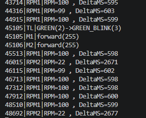

- [Homework-MiniProject image and video](https://drive.google.com/drive/folders/1uvNn0t36OslVI_NthCYIJN-oSkL_UShL?usp=sharing)
    - [TrafficLights](./src/TrafficLights.h#L7) external LEDs for traffic light
    - [L298NMotor with PWM](./src/hardware/L298NMotor.h): PWM-controlled DC-motors that simulates movement of Pedestrian and car
    - RPM calculation:
      - [LightResistor(ADC)](./src/hardware/ADC.h) — LDRs that are in shadow of rotating disks with special square and special "measuring led" that lights on sensors.
    
      - [RPMCounter](./src/RPMCounter.h) calculates RPM of rotating disks by measuring time between signal peaks (peak-to-peak interval).
        - RPM outputs in Serial Port IO
        - 
    - [Potentiometer(ADC)](./src/hardware/ADC.h) - limits max speed
    - [SpeedSignal](./src/SpeedSignal.h) - lights board LED RED when RPM threshold exceeded by any RPMCounter, WHITE otherwise.
    - [Buttons](./src/hardware/Button.h)
      - [MainButton](./src/main.cpp#L51)
        - "released" - [onMainBtnRelease](./src/main.cpp#L105) - moves traffic lights to next state
        - "long press" - [onMainBtnLongPress](./src/main.cpp#L109) - pauses traffic lights
      - [BootButton](./src/main.cpp#L52)
        - "released" - [onBootBtnReleased](./src/main.cpp#L100) - rotates motors speeds
        - "long press" - [onBootBtnLongPress](./src/main.cpp#L95) - resets speed to maximum
